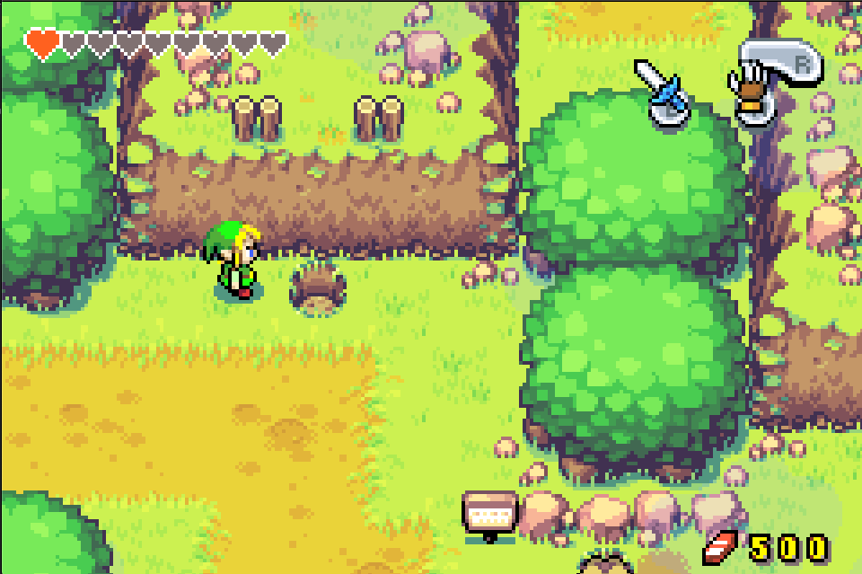

When I was a kid, I spent countless hours playing classic 2D platformer games like Mario, Tetris, and Pac-Man on a NES clone, along with a ton of Gameloft mobile games like Diamond Rush and Bounce Tales, built for those old Nokia phones running Java or Symbian (remember those?). Little did I know, those experiences sparked a deep curiosity in me. I became fascinated with how these cool games were made, and that fascination eventually led me down the path of wanting to learn how to build them myself. It was the start of a journey into the world of programming.

Now about Zelda, _The Legend of Zelda: The Minish Cap_ is a delightful addition to the legendary franchise, known for its rich storytelling and innovative gameplay. Released for the Game Boy Advance in 2004, the game introduces a range of mechanics that enhance exploration, puzzle-solving, and combat, all set in a charming world filled with adventure. In this blog post, we’ll delve into the main gameplay mechanics that make _The Minish Cap_ a standout title.

## Interconnected World Design

The world of _The Minish Cap_ is carefully crafted to feel interconnected and cohesive. Players can travel between different regions of Hyrule, with areas often leading into one another. This design encourages backtracking, as players can return to previously explored locations with new items and abilities to uncover secrets. The seamless transitions between environments enhance the immersion, making the world feel alive and responsive.

## Puzzles and Environmental Interactions

Puzzles are a staple of the _Zelda_ series, and _The Minish Cap_ is no exception. The game features a variety of puzzles that are often tied to its unique mechanics. From simple block-pushing challenges to more complex riddles that require players to manipulate the environment, these puzzles require creative thinking and exploration. For instance, players must use the shrinking mechanic to navigate through obstacles or activate switches that change the layout of dungeons. This integration of environmental interactions and puzzles adds depth to the gameplay.

## Exploration and Collectibles

Exploration is a core aspect of _The Minish Cap_. Players are encouraged to wander the lush environments of Hyrule, uncovering secrets and collectibles. In addition to Kinstones, players can find heart pieces, mysterious shells, and other treasures that enhance Link’s abilities and overall health. The thrill of discovery is heightened by the game’s expansive world, filled with hidden areas and optional side quests.

## Items and Tools

Throughout _The Minish Cap_, Link collects a range of items and tools that enhance his abilities and allow for new strategies in combat and puzzle-solving. Key items include:

- **Gust Jar**: This tool allows Link to suck in objects and enemies, then release them as projectiles, useful for solving puzzles or combat.
- **Cane of Pacci**: This item flips objects and enemies, which can create new pathways and reveal hidden areas.
- **Mole Mitts**: Used for digging through certain types of terrain, revealing shortcuts and secrets.

These items are not only fun to use but also integrate seamlessly into the game's design, encouraging players to experiment with different approaches to challenges.

## Dynamic Combat Mechanics

Combat in _The Minish Cap_ features a variety of enemies, each requiring different strategies to defeat. Players can use standard sword attacks, shield blocks, and special techniques learned throughout the game. One exciting element is the use of the **Four Sword**, which allows Link to create copies of himself to tackle puzzles that require multiple actions simultaneously. This mechanic adds a strategic layer to combat, as players can coordinate their clones to take down tougher foes or activate multiple switches.

## Dungeons and Boss Battles

Dungeons in _The Minish Cap_ are intricately designed, each presenting its own theme, puzzles, and enemies. Players must navigate through various rooms, using their items to progress and solve challenges. Each dungeon culminates in a boss battle that tests the player's skills and understanding of the mechanics learned throughout the dungeon. The variety of bosses, each with unique attack patterns and weaknesses, ensures that combat remains engaging and challenging.

## Shrink Down with the Minish Cap

One of the defining mechanics of _The Minish Cap_ is Link’s ability to shrink down to a tiny size using the magical Minish Cap, worn on his head. This transformation not only alters Link's physical stature but also opens up new pathways and areas to explore. The tiny version of Link can traverse places that are otherwise inaccessible, such as tiny houses and paths hidden within the grass. This duality adds an exciting layer of exploration, as players often need to switch between sizes to solve puzzles and navigate the world.

## Kinstone Fusion

Another unique feature of _The Minish Cap_ is the Kinstone Fusion system. Throughout Hyrule, players can collect Kinstone pieces that can be combined with those of NPCs to unlock various rewards, such as treasure chests, new quests, or changes in the environment. This mechanic encourages interaction with the world and its characters, making each encounter feel meaningful. It also promotes exploration, as players are motivated to seek out Kinstone pieces and engage with the numerous inhabitants of Hyrule.

## Conclusion

_The Legend of Zelda: The Minish Cap_ showcases an array of innovative gameplay mechanics that elevate the player experience. From the unique shrinking mechanic to engaging puzzles and dynamic combat, each element contributes to a rich and immersive adventure. As players navigate Hyrule and interact with its inhabitants, they are constantly rewarded for their curiosity and creativity. This combination of exploration, puzzle-solving, and combat has solidified _The Minish Cap_ as a beloved entry in the _Zelda_ franchise, leaving players with a sense of wonder and accomplishment long after they’ve completed their journey.
